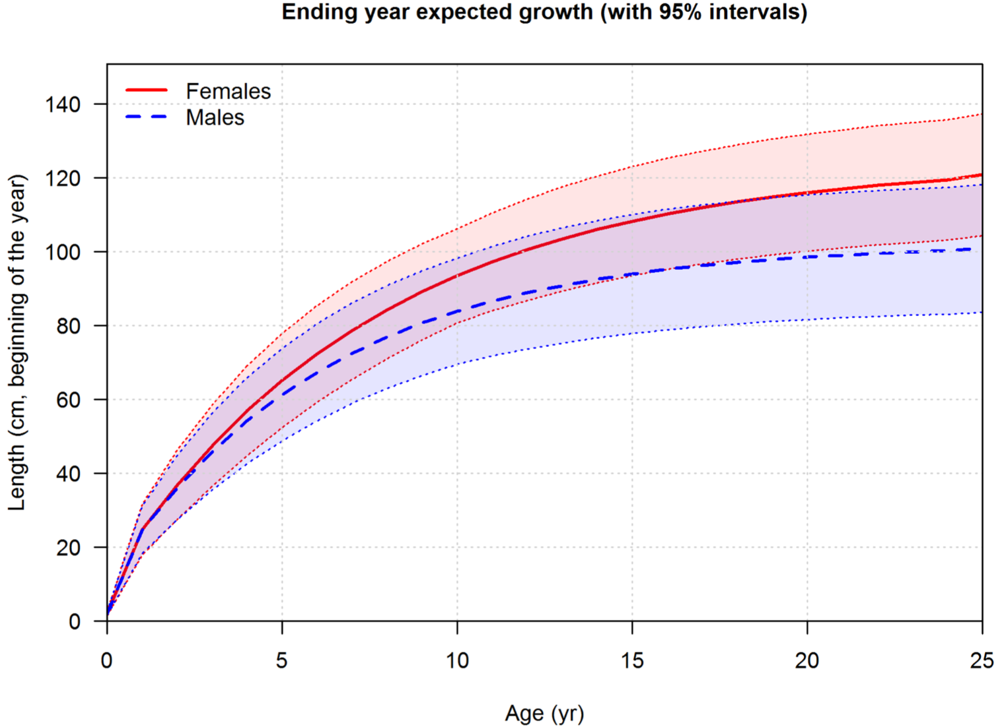

```{r setup, include=FALSE}
knitr::opts_chunk$set(echo = TRUE)
knitr::opts_knit$set(root.dir = "/Users/andrea/Box/UC DAVIS/Oken Lab/lingcod-rockfish")
```

### July 1, 2021

This week, I did a literature search on "Conditional age-at-length" (CAAL) and was pretty unsuccessful. Much of the literature spoke about integrated stock assessments and estimating CAAL within the stock assessment as opposed to estimating through data externally and using those fixed estimates in stock assessments. I felt like what I was finding wasn't relevant to what I needed since I'm just trying to estimate the growth curve parameters to predict missing ages in the dataset. The CAAL search came about when I mentioned that there may have been a downward bias in the predicted ages compared to observed ages. This was a quick observation I had made based on the data that I saw, but of course I didn't see everything, so I went back to check if my observation was correct by determining the proportion of predictions that underestimated, overestimated, and correctly estimated.


```{r length bias, echo = FALSE, message = FALSE}
library(tidyverse)
load("cleaned_data/lingcod_rockfish.Rdata")

lingcod_age_comparison <- lingcod_rockfish %>% 
  select(Ages, age_pred)

predicted_smaller = lingcod_age_comparison$Ages > lingcod_age_comparison$age_pred
predicted_smaller <- predicted_smaller[!is.na(predicted_smaller)]
underestimated = sum(predicted_smaller) #296 underestimated

predicted_bigger = lingcod_age_comparison$Ages < lingcod_age_comparison$age_pred
predicted_bigger <- predicted_bigger[!is.na(predicted_bigger)]
overestimated = sum(predicted_bigger) #522 overestimated

predicted_same = lingcod_age_comparison$Ages == lingcod_age_comparison$age_pred
predicted_same <- predicted_same[!is.na(predicted_same)]
estimated_well = sum(predicted_same) # 313 estimated well

total_estimated = underestimated + overestimated + estimated_well
underestimated/total_estimated
overestimated/total_estimated
estimated_well/total_estimated
```

There wasn't much difference in these numbers between male and female, so no sex-related bias. Looking at the estimated growth curve over the observed data for males and females, it may be that the older ages are being underestimated and the younger ages are being overestimated. I am using the francis parameterization, which may not be the best way to model the growth for this dataset. So I can try other parameterizations. I think I was using the francis parameterization because I was trying to use a package originally, and it was the only one that would work. But then I ended up not using the package anyway and I guess I just stuck with that one.

```{r VBGF, echo = FALSE, message = FALSE}
# MALES
ages_francis_male <- c(3,11) # male t1 and t3 age
male_TL_aget1 = lingcod_rockfish %>% # Filter out all male age at t1
  filter(Sex.1 == "M", Ages == ages_francis_male[1]) %>% 
  select(TL.cm)
male_TL_aget2 = lingcod_rockfish %>% # Filter out all male at t2
  filter(Sex.1 == "M", Ages == mean(ages_francis_male)) %>% 
  select(TL.cm)
male_TL_aget3 = lingcod_rockfish %>% # Filter out all male at t3
  filter(Sex.1 == "M", Ages == ages_francis_male[2]) %>% 
  select(TL.cm)
L1_m <- mean(male_TL_aget1$TL.cm) # mean length at relatively young age t1 (age 3 used here)
L2_m <- mean(male_TL_aget2$TL.cm) # mean length at the average of t1 and t2 (age 7 used here)
L3_m <- mean(male_TL_aget3$TL.cm) # mean length at relatively old age t2 (age 11 used here)
r_m <- (L3_m-L2_m)/(L2_m-L1_m)

predict_age_m <- function(length) { # Function that predicts male age given length
  if(length >= 93) { # I chose this length because that's when the predicted age goes above 20
    pred_age <-  20 # set max age to 20
  } else {
    pred_age <- ages_francis_male[1] + (ages_francis_male[2]-ages_francis_male[1])*((log(1-(1-r_m^2)*((length-L1_m)/(L3_m-L1_m))))/(2*log(r_m)))
  }
  return(pred_age) 
}

# FEMALES
ages_francis_female <- c(3,15)
female_TL_aget1 = lingcod_rockfish %>% # Filter out all female age at t1
  filter(Sex.1 == "F", Ages == ages_francis_female[1]) %>% 
  select(TL.cm)
female_TL_aget2 = lingcod_rockfish %>% # Filter out all female age at t2
  filter(Sex.1 == "F", Ages == mean(ages_francis_female)) %>% 
  select(TL.cm)
female_TL_aget3 = lingcod_rockfish %>% # Filter out all female age at t2
  filter(Sex.1 == "F", Ages == ages_francis_female[2]) %>% 
  select(TL.cm)
L1_f <- mean(female_TL_aget1$TL.cm)  # mean length at relatively young age t1 (age 3 used here)
L2_f <- mean(female_TL_aget2$TL.cm)  # mean length at the average of t1 and t2 (age 9 used here)
L3_f <- mean(female_TL_aget3$TL.cm) # mean length at relatively old age t2 (age 15 used here)
r_f <- (L3_f-L2_f)/(L2_f-L1_f)

predict_age_f <- function(length) {
  if(length >= 117) {
    pred_age <-  20
  } else {
    pred_age <- ages_francis_female[1] + (ages_francis_female[2]-ages_francis_female[1])*((log(1-(1-r_f^2)*((length-L1_f)/(L3_f-L1_f))))/(2*log(r_f)))
  }
  return(pred_age) 
}

# this helps prevent the warning messages.
v_predict_age_m <- Vectorize(predict_age_m)
v_predict_age_f <- Vectorize(predict_age_f)
```

```{r growthplots, echo = FALSE}
lingcod_male <- lingcod_rockfish %>% 
  filter(Sex.1 == "M")
lingcod_female <- lingcod_rockfish %>% 
  filter(Sex.1 == "F")

#males
predicted_age_m = sapply(1:120, predict_age_m)
predicted_age_m = pmax(predicted_age_m, 0)
predicted_age_m = as.data.frame(predicted_age_m) %>% 
  mutate(length = 1:120)
#females
predicted_age_f = sapply(1:120, predict_age_f)
predicted_age_f = pmax(predicted_age_f, 0)
predicted_age_f = as.data.frame(predicted_age_f) %>% 
  mutate(length = 1:120)

plot(lingcod_female$Ages, lingcod_female$TL.cm, type = "p", xlab = "Ages", ylab = "Length (cm)", main = "female", ylim = c(0,120))
lines(predicted_age_f$predicted_age_f, predicted_age_f$length)

plot(lingcod_male$Ages, lingcod_male$TL.cm, type = "p", xlab = "Ages", ylab = "Length (cm)", main = "male", ylim = c(0,100))
lines(predicted_age_m$predicted_age_m, predicted_age_m$length)
```

During my literacture search, however, I did find a paper that uses Bayesian length-at-age models to estimate the growth curve parameters. So, I think I'll give it a shot... (if you think its worth it). One thing that it mentioned (of the small bit that I've read of the paper so far) is that the use of priors on information of min and max lengths can help a lot when there's limited data for those sizes in your dataset. So, I can pull that information from the lingcod stock assessment. BUT there are some discrepancies it seems like ...

##### Notes-  

$L\infty = 131 cm$ for females and $L\infty= 93 cm$ for males sampled off of British Columbia (Richards et al. 1990).  
Upon hatching, the larvae are about 12 mm in total length and become epipelagic. 70-80 mm at about 3 months of age.  
Externally estimated growth parameters using the 2003-2015 WCBTS is $k=0.191$ and $L\infty=100.9$ (female) and $k=0.214$ and $L\infty=86.3$ (male) for the south. Internally estimate growth curves for south (CA) are shown in figure 41  
{height=50%}


So, it seems like the external estimates and my own visualization of the internally estimate growth curve above do not correspond to each other well. How come? Obviously data are different, but should it really make that much of a difference if we're trying to estimate the same populations? The internally estimated growth curve looks less like Bonnie's data than the externally estimated parameters.


Now, to think about diet compositions


```{r pressure, echo=FALSE}

```


